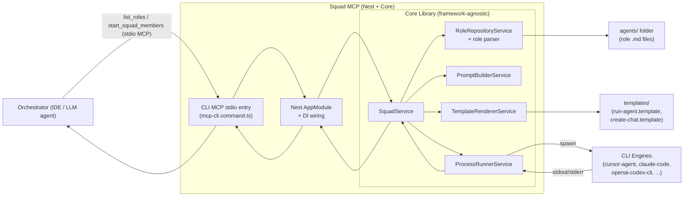
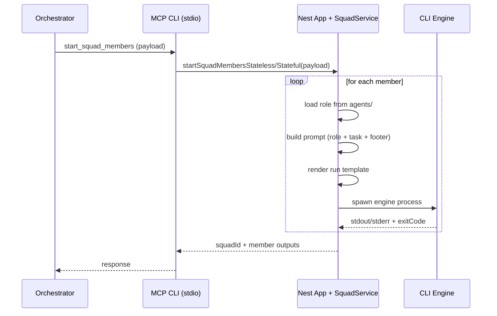

# Gs Squad MCP – Implementation Blueprint (v1)

> A TypeScript / NestJS MCP that spawns role-specialized CLI agents using stdio, with a clear path to HTTP/SSE in v2.

---

## 1. Goals & Scope

### 1.1 Primary goal

Implement an MCP named `@growthspace-engineering/gs-squad-mcp` that:

* Runs primarily in **stdio mode** (MCP stdio server).
* Exposes two tools:

  * `list_roles`
  * `start_squad_members`
* Spawns **one or more CLI agents** (Cursor Agent CLI, Claude Code CLI, etc.) that:

  * Operate under **role definitions** from an `agents/` folder.
  * Run in a specific **cwd** inside the workspace (or entire workspace).
  * Optionally reuse **chat sessions** in stateful mode.
* Returns:

  * `squadId`, `memberId`s,
  * `status` (`completed | error | timeout`),
  * **raw stdout/stderr** (no semantic parsing).

### 1.2 Non-goals (v1)

* HTTP/SSE/streamable-http protocol.
* Long-running orchestration logic (that’s the orchestrator’s job).
* Sophisticated parsing of agent outputs.
* Persistent storage of squad runs beyond memory.

---

## 2. Core Principles & Constraints

### 2.1 Architecture & layering

* Core logic must be **framework-agnostic** (Nest is just the host).
* Transports (stdio now, HTTP later) are **adapters** around the same core.

### 2.2 Coding standards

* **File names:** kebab-case + type suffix, e.g.:

  * `squad.service.ts`
  * `role-repository.service.ts`
  * `list-roles.response.ts`
* **Class names:** PascalCase.
* **Interface names:** `I` + PascalCase, e.g. `IRoleDefinition`.
* **Variables:** no single-letter or cryptic abbreviations:

  * Use `workspaceRootPath`, `squadMemberInput`, not `wr`, `s`.
* **Comments:** code is its own doc; only comment genuinely non-obvious logic.

### 2.3 Contracts

* All tool inputs/outputs live in `contracts/`:

  * `*.payload.ts` for inputs.
  * `*.response.ts` for outputs.
* No `.dto.ts`.

### 2.4 Modes & behavior

* **State mode** is configured at MCP startup:

  * `STATE_MODE=stateless | stateful`
* Stateless mode:

  * No chat IDs.
  * Every call injects **role prompt + task**.
* Stateful mode:

  * On first run (no `chatId`): create chat + inject **role prompt + initial task**.
  * On reuse (`chatId` present): inject **task only**.

### 2.5 Output parsing

* The MCP does **not parse** agent outputs as JSON or special formats.
* It only:

  * captures `stdout`, `stderr`,
  * determines `status` from exit code / timeout,
  * returns them verbatim.
* Orchestrator LLM interprets the output.

---

## 3. High-Level Architecture

### 3.1 Component view



### 3.2 Layers

* `src/core` – pure TS:

  * config, roles, prompt builder, template renderer, process runner, squad service.
* `src/nest` – Nest wiring (`AppModule`).
* `src/cli` – MCP stdio entrypoint via `nest-commander`.
* `src/http` – reserved for v2 (HTTP/SSE entry).

---

## 4. Directory Layout

```text
src/
  core/
    config/
      squad-config.interface.ts
      squad-config.service.ts
    roles/
      role-definition.interface.ts
      role-repository.service.ts
    prompt/
      prompt-builder.service.ts
    engine/
      template-renderer.service.ts
      process-runner.service.ts
    mcp/
      squad.service.ts
      contracts/
        list-roles.response.ts
        start-squad-members-stateless.payload.ts
        start-squad-members-stateless.response.ts
        start-squad-members-stateful.payload.ts
        start-squad-members-stateful.response.ts
  nest/
    app.module.ts
  cli/
    mcp-cli.command.ts
    main-stdio.ts
  http/                (v2: HTTP/SSE)
    mcp.controller.ts
    main-http.ts

agents/                (role markdown files)
templates/             (command templates)
mcp.json
package.json
tsconfig.json
.eslintrc.cjs
jest.config.cjs
jest-e2e.config.cjs
.github/
  workflows/
    ci.yml
    release.yml
test/
  e2e/
    squad-mcp.e2e-spec.ts
```

Unit tests live next to their implementation:

```text
src/core/prompt/prompt-builder.service.ts
src/core/prompt/prompt-builder.service.spec.ts
```

---

## 5. Contracts (Tool Inputs & Outputs)

### 5.1 Role contracts

```ts
// src/core/roles/role-definition.interface.ts
export interface IRoleDefinition {
  id: string;           // "frontend-developer" (from filename)
  name: string;         // from frontmatter or id
  description: string;  // from frontmatter or ""
  body: string;         // markdown body (role prompt)
}
```

### 5.2 list_roles

```ts
// src/core/mcp/contracts/list-roles.response.ts
export interface IListRolesResponse {
  roles: {
    id: string;
    name: string;
    description: string;
  }[];
}
```

### 5.3 start_squad_members – shared parts

```ts
// In a suitable contracts file
export interface IStartSquadMemberInputCommon {
  roleId: string;
  task: string;
  cwd?: string;
}

export interface IStartSquadMemberOutputBase {
  memberId: string;
  roleId: string;
  cwd?: string;
  status: 'completed' | 'error' | 'timeout';
  rawStdout: string;
  rawStderr: string;
}
```

#### Stateless payload / response

```ts
// start-squad-members-stateless.payload.ts
export interface IStartSquadMembersStatelessPayload {
  members: IStartSquadMemberInputCommon[];
  metadata?: Record<string, unknown>;
}
```

```ts
// start-squad-members-stateless.response.ts
export interface IStartSquadMembersStatelessResponse {
  squadId: string;
  members: IStartSquadMemberOutputBase[];
}
```

#### Stateful payload / response

```ts
// start-squad-members-stateful.payload.ts
export interface IStartSquadMemberStatefulInput
  extends IStartSquadMemberInputCommon {
  chatId?: string | null;
}

export interface IStartSquadMembersStatefulPayload {
  members: IStartSquadMemberStatefulInput[];
  metadata?: Record<string, unknown>;
}
```

```ts
// start-squad-members-stateful.response.ts
export interface IStartSquadMemberStatefulOutput
  extends IStartSquadMemberOutputBase {
  chatId: string;
}

export interface IStartSquadMembersStatefulResponse {
  squadId: string;
  members: IStartSquadMemberStatefulOutput[];
}
```

### 5.4 Squad service API

```ts
// src/core/mcp/squad.service.ts
export class SquadService {
  async listRoles(): Promise<IListRolesResponse> { ... }

  async startSquadMembersStateless(
    payload: IStartSquadMembersStatelessPayload
  ): Promise<IStartSquadMembersStatelessResponse> { ... }

  async startSquadMembersStateful(
    payload: IStartSquadMembersStatefulPayload
  ): Promise<IStartSquadMembersStatefulResponse> { ... }
}
```

No separate interface file is needed.

---

## 6. Role System (agents/ Folder)

### 6.1 Role source and structure

* Roles are defined as Markdown files in `agents/`.
* File name (without `.md`) is the `roleId`.

Example:

```text
agents/
  frontend-developer.md
  backend-developer.md
  qa-engineer.md
  architect.md
  ...
```

Each file:

```md
---
name: frontend-developer
description: Frontend development specialist responsible for UI/UX implementation...
---

You are a frontend development specialist focused on creating responsive...
...
```

* **Frontmatter:**

  * `name` – label (falls back to `id` if missing).
  * `description` – used in `list_roles`.
* **Body:** full role prompt used by `PromptBuilderService`.

### 6.2 Role repository behavior

* Loads all `*.md` files from `agentsDirectoryPath` (from config).
* Parses YAML frontmatter and body.
* Caches roles in memory.

### 6.3 list_roles implementation

* Calls `RoleRepositoryService.getAllRoles()`.
* Maps to:

```ts
{
  roles: roles.map(role => ({
    id: role.id,
    name: role.name,
    description: role.description
  }))
}
```

No engine, state, or workspace info is exposed.

---

## 7. Prompt Construction

### 7.1 Setup & reporting footer (always appended)

Injected into every prompt:

```text
---

# Setup & Reporting Rules

If you notice any setup or environment problems that prevent you from completing your task,
you MUST clearly report them as SETUP / ENVIRONMENT ISSUES.

Explain what you observed and suggest specific steps for the human to fix.
Do not pretend the task succeeded if the environment blocks you.
```

The orchestrator LLM interprets this; MCP does not parse it.

### 7.2 Stateless mode prompts

```ts
buildPromptStateless(role, task):

# Role

<role.body>

---

# Task

<task>

<Setup & Reporting Rules>
```

### 7.3 Stateful mode prompts

* **New chat (no chatId):**

```ts
buildPromptStatefulNewChat(role, task):

# Role

<role.body>

---

# Initial Task

<task>

<Setup & Reporting Rules>
```

* **Existing chat (chatId present):**

```ts
buildPromptStatefulExistingChat(task):

# Task

<task>

<Setup & Reporting Rules>
```

### 7.4 Prompt builder service

```ts
export class PromptBuilderService {
  buildPromptStateless(...): string { ... }
  buildPromptStatefulNewChat(...): string { ... }
  buildPromptStatefulExistingChat(...): string { ... }
}
```

---

## 8. Config & Templates

### 8.1 Config

```ts
// src/core/config/squad-config.interface.ts
export type SquadStateMode = 'stateless' | 'stateful';

export interface ISquadConfig {
  stateMode: SquadStateMode;
  engineCommand: string;
  runTemplatePath: string;
  createChatTemplatePath?: string;
  agentsDirectoryPath: string;
  processTimeoutMs: number;
}
```

`SquadConfigService` reads envs and provides defaults.

### 8.2 Templates

* Stored in `templates/`:

  * `run-agent.template`
  * `create-chat.template` (stateful only)

Example `run-agent.template`:

```txt
cursor-agent --approve-mcps --model composer-1 --print \
<% if (chatId) { %> --resume <%= chatId %> <% } %> \
agent "<%= prompt %>"
```

Template context:

* `prompt`
* `chatId` (stateful)
* `cwd`
* `roleId`
* `task`

### 8.3 Template renderer

```ts
export class TemplateRendererService {
  render(templateContent: string, context: Record<string, unknown>): string[] {
    // returns array of args for spawn (without engineCommand)
  }
}
```

---

## 9. Process Runner & Status

### 9.1 Process runner

```ts
export interface IProcessResult {
  exitCode: number | null;
  stdout: string;
  stderr: string;
  timedOut: boolean;
}

export class ProcessRunnerService {
  async runProcess(
    command: string,
    args: string[],
    cwd: string,
    timeoutMs: number
  ): Promise<IProcessResult> { ... }
}
```

### 9.2 Status mapping

* `exitCode === 0 && !timedOut` → `status: "completed"`
* `exitCode !== 0 && !timedOut` → `status: "error"`
* `timedOut === true` → `status: "timeout"`

No deeper interpretation.

---

## 10. Squads & Execution Flow

### 10.1 Single call, many members



### 10.2 Stateful chatId flow (per member)

```mermaid
flowchart TD
  A[Member has chatId?] -->|No| B[Run create-chat template\n(spawn engine)]
  B --> C[Read chatId from stdout]
  C --> D[Build prompt with role + initial task]
  A -->|Yes| E[Build prompt with task only]
  D --> F[Render run template]
  E --> F
  F --> G[Spawn engine for task]
  G --> H[Collect stdout/stderr + exitCode]
  H --> I[Return member output + chatId]
```

---

## 11. Nest Integration & MCP Stdio Entry

### 11.1 AppModule

```ts
@Module({
  imports: [
    ConfigModule.forRoot({ isGlobal: true })
  ],
  providers: [
    SquadConfigService,
    RoleRepositoryService,
    PromptBuilderService,
    TemplateRendererService,
    ProcessRunnerService,
    SquadService
  ],
  exports: [SquadService]
})
export class AppModule {}
```

### 11.2 MCP CLI command

```ts
@Command({
  name: 'mcp',
  description: 'Squad MCP stdio server'
})
export class McpCliCommand extends CommandRunner {
  constructor(private readonly squadService: SquadService) {
    super();
  }

  async run(): Promise<void> {
    // 1. Initialize MCP stdio protocol.
    // 2. Loop reading requests from stdin.
    // 3. For each:
    //    - parse JSON
    //    - route to listRoles / startSquadMembers*
    //    - write JSON response to stdout
    // 4. Never exit until process is killed.
  }
}
```

### 11.3 main-stdio entry

```ts
async function bootstrap(): Promise<void> {
  const app = await NestFactory.createApplicationContext(AppModule, {
    logger: ['error', 'warn', 'log']
  });

  const cliCommand = app.get(McpCliCommand);
  await cliCommand.run();
}

bootstrap().catch(() => process.exit(1));
```

NPM’s `bin` will point to this compiled entry so `npx -y @growthspace-engineering/gs-squad-mcp` starts the MCP stdio server.

---

## 12. Testing Strategy

### 12.1 Unit tests

* Framework: **Jest**
* Location: next to implementations
* Suffix: `*.spec.ts`

Examples:

```text
src/core/roles/role-repository.service.spec.ts
src/core/prompt/prompt-builder.service.spec.ts
src/core/mcp/squad.service.spec.ts
```

Focus:

* Role loading/parsing.
* Prompt construction (all modes).
* Template rendering.
* Process runner behavior (using fake commands).
* SquadService logic (mock dependencies).

### 12.2 e2e tests

* Location: `test/e2e`
* Suffix: `*.e2e-spec.ts`

Example scenarios:

* `listRoles` returns actual roles from `agents/`.
* Stateless start:

  * Spawns a fake engine command and returns correct status.
* Stateful start:

  * Creates chat,
  * Reuses chatId,
  * Returns outputs.

---

## 13. Linting & Style

* **ESLint only** (no Prettier).

* Key rules:

  * Single quotes:

    * `quotes: ['error', 'single']`
  * Max line length 80:

    * `max-len: ['error', { code: 80, ignoreUrls: true }]`
  * No trailing commas:

    * `comma-dangle: ['error', 'never']`
  * Spaces inside single-line objects/arrays:

    * `object-curly-spacing: ['error', 'always']`
    * `array-bracket-spacing: ['error', 'always']`
  * Multiline method signature style:

    ```ts
    methodName(
      inputOne: TypeOne,
      inputTwo: TypeTwo
    ): OutputType {
      // implementation
    }
    ```

* No single-letter or cryptic variable names.

---

## 14. Dev Workflow, TDD, and Hooks

### 14.1 TDD-style workflow

For each feature:

1. **Define tests as TODOs**:

   * Use `test.todo` / `it.todo` in `*.spec.ts` describing expected behavior.
2. **Implement code chunk**:

   * Implement the minimal logic to support the TODO tests.
3. **Turn TODOs into real tests**:

   * Replace with actual `test(...)` and assertions.
4. **Run tests**:

   * `npm test`
5. **Coverage check** (when unit/module is “done”):

   * `npm test -- --coverage`
   * Add tests to cover important uncovered lines.

### 14.2 Atomic commits

* Each commit should:

  * `npm run lint` successfully,
  * `npm test` successfully,
  * and ideally `npm run test:e2e` (for larger changes).
* No commits that leave tests broken or build failing.

### 14.3 Husky hooks

Use Husky to enforce local checks:

* `pre-commit`:

  * `npm run lint`
  * `npm test`
* Optional `pre-push`:

  * `npm run test:e2e`

### 14.4 Commitlint & Commitizen

* Reuse pattern from `gs-mcp-proxy-pii-redactor`:

  * **Commitlint** to enforce conventional commits:

    * `feat: ...`, `fix: ...`, `chore: ...`, `refactor: ...`, etc.
  * **Commitizen**:

    * `npm run commit` interactive flow to craft valid messages.
* Husky `commit-msg` hook calls Commitlint.

---

## 15. CI/CD & Publishing

### 15.1 GitHub Actions – CI

`ci.yml`:

* Triggers: `push`, `pull_request`.
* Steps:

  * `npm ci`
  * `npm run lint`
  * `npm test`
  * `npm run test:e2e`
  * `npm run build`

### 15.2 GitHub npm Registry

* Package name:
  `"name": "@growthspace-engineering/gs-squad-mcp"`
* Use GitHub Packages for npm:

  * `"publishConfig": { "registry": "https://npm.pkg.github.com" }`
* `.npmrc` in CI:

  * `@growthspace-engineering:registry=https://npm.pkg.github.com`
* `release.yml`:

  * Triggered on tag or `main` release branch.
  * `npm ci`
  * `npm run build`
  * `npm publish --access=restricted` with `NODE_AUTH_TOKEN` (PAT).

---

## 16. Multi-Orchestrator Safety

* `SquadService` is **stateless per call** (no global squad registry).
* `squadId` / `memberId` are local opaque IDs (unique per process).
* Chat history is owned by the **CLI engine** via `chatId`, not by MCP.
* Multiple IDEs and orchestrators can:

  * run their own `gs-squad-mcp` processes, or
  * even share one process,
  * without interfering, unless they explicitly share `chatId`s.

## 17. Implementation TODO Checklist

> Follow in **small, atomic, always-green commits**, using TDD with
> `test.todo` / `it.todo` where possible.

### 17.1 Milestone 0 – Repo bootstrap

* [x] Initialize Node/TypeScript project

  * [x] `npm init` with `"name": "@growthspace-engineering/gs-squad-mcp"`
  * [x] Add `tsconfig.json`
  * [x] Add `.gitignore`
* [x] Add NestJS

  * [x] Install NestJS and CLI
  * [x] Scaffold basic Nest project structure (no HTTP server needed yet)
* [x] Add Jest test setup

  * [x] Unit test config (`jest.config.cjs`)
  * [x] E2E test config (`jest-e2e.config.cjs`)
* [x] Add ESLint

  * [x] Configure single quotes, 80-char max, no trailing commas
  * [x] Configure object/array spacing rules
* [x] Add basic scripts to `package.json`

  * [x] `"build"`, `"lint"`, `"test"`, `"test:e2e"`

---

### 17.2 Milestone 1 – Config + Core skeleton

**Goal:** Core scaffolding compiles, basic tests are in place (even if TODOs).

* [x] Create `ISquadConfig` and `SquadConfigService`

  * [x] `src/core/config/squad-config.interface.ts`
  * [x] `src/core/config/squad-config.service.ts`
  * [x] Read env vars:

    * [x] `STATE_MODE`
    * [x] `ENGINE_COMMAND`
    * [x] `RUN_TEMPLATE_PATH`
    * [x] `CREATE_CHAT_TEMPLATE_PATH`
    * [x] `AGENTS_DIRECTORY_PATH`
    * [x] `PROCESS_TIMEOUT_MS`
  * [x] Add unit test file with `test.todo` for:

    * [x] default values
    * [x] env override behavior
* [x] Create `IRoleDefinition`

  * [x] `src/core/roles/role-definition.interface.ts`
* [x] Create empty implementations (with TODO tests):

  * [x] `RoleRepositoryService`
  * [x] `PromptBuilderService`
  * [x] `TemplateRendererService`
  * [x] `ProcessRunnerService`
  * [x] `SquadService` (method signatures only)
* [x] Add `AppModule` wiring all these services

  * [x] `src/nest/app.module.ts`
  * [x] Basic test to ensure Nest context boots without error

---

### 17.3 Milestone 2 – Role system (agents/)

**Goal:** `listRoles` works against real `agents/` files.

* [x] Create `agents/` folder
* [x] Import initial role definitions

  * [x] Copy/adapt roles from `jamsajones/claude-squad`
  * [x] Copy/adapt additional roles from `google/adk-samples`
  * [x] Normalize each:

    * [x] Remove vendor-specific references (Claude, Gemini, ADK, etc.)
    * [x] Ensure frontmatter has `name`, `description`
    * [x] Align body structure with your preferred format
* [x] Implement `RoleRepositoryService`

  * [x] Load `.md` files from `agentsDirectoryPath`
  * [x] Parse frontmatter to `name` + `description`
  * [x] Extract body
  * [x] Cache in memory
* [x] Unit tests (`role-repository.service.spec.ts`)

  * [x] `test.todo`: loads roles from folder
  * [x] `test.todo`: parses frontmatter correctly
  * [x] `test.todo`: returns null for unknown role
  * [x] Implement tests & logic
* [x] Implement `SquadService.listRoles`

  * [x] Uses `RoleRepositoryService.getAllRoles`
  * [x] Maps to `IListRolesResponse`
* [x] Unit tests for `listRoles`

  * [x] `test.todo`: returns expected shape
  * [x] `test.todo`: reflects updated agents
  * [x] Implement tests & logic

---

### 17.4 Milestone 3 – Prompt building

**Goal:** Prompt construction for stateless and stateful modes is solid and tested.

* [x] Implement `PromptBuilderService`

  * [x] `buildPromptStateless(role, task)`
  * [x] `buildPromptStatefulNewChat(role, task)`
  * [x] `buildPromptStatefulExistingChat(task)`
  * [x] Append setup/reporting footer in all three paths
* [x] Unit tests (`prompt-builder.service.spec.ts`)

  * [x] `test.todo`: stateless prompt contains:

    * [x] `# Role` + role body
    * [x] `# Task` + task text
    * [x] setup & reporting footer
  * [x] `test.todo`: stateful new chat contains:

    * [x] `# Role` + role body
    * [x] `# Initial Task` + task
    * [x] footer
  * [x] `test.todo`: stateful existing chat contains:

    * [x] `# Task` + task only
    * [x] footer
  * [x] Implement tests & logic
* [x] Run unit tests and fix any failures
* [x] Run coverage to ensure key paths are covered

---

### 17.5 Milestone 4 – Template rendering & process runner

**Goal:** We can render command templates and run a CLI command with timeout.

* [ ] Implement `TemplateRendererService`

  * [ ] Read template content from disk
  * [ ] Render with context (`prompt`, `chatId`, `cwd`, `roleId`, `task`)
  * [ ] Return an array of arguments for `spawn`
* [ ] Unit tests (`template-renderer.service.spec.ts`)

  * [ ] `test.todo`: handles template without `chatId`
  * [ ] `test.todo`: handles template with `chatId`
  * [ ] `test.todo`: trims / splits args correctly
  * [ ] Implement tests & logic
* [ ] Implement `ProcessRunnerService`

  * [ ] `runProcess(command, args, cwd, timeoutMs)`
  * [ ] Uses `child_process.spawn`
  * [ ] Aggregates `stdout`, `stderr`
  * [ ] Handles timeout with `timedOut` flag
* [ ] Unit tests (`process-runner.service.spec.ts`)

  * [ ] `test.todo`: successful command → exitCode 0
  * [ ] `test.todo`: failing command → non-zero exitCode
  * [ ] `test.todo`: long-running command → timeout
  * [ ] Implement tests & logic

---

### 17.6 Milestone 5 – SquadService behavior

**Goal:** Core squad logic for stateless & stateful modes is implemented and tested.

* [ ] Implement `startSquadMembersStateless` in `SquadService`

  * [ ] Generate `squadId`
  * [ ] For each member:

    * [ ] Load role by `roleId`
    * [ ] Build prompt (stateless)
    * [ ] Render run template
    * [ ] Run process with `ProcessRunnerService`
    * [ ] Map result to `IStartSquadMemberOutputBase`
* [ ] Unit tests (`squad.service.spec.ts`) – stateless

  * [ ] `test.todo`: single member happy path
  * [ ] `test.todo`: multiple members in one call
  * [ ] `test.todo`: missing role → error handling
  * [ ] `test.todo`: status mapping (exitCode/timeouts)
  * [ ] Implement tests & logic
* [ ] Implement `startSquadMembersStateful`

  * [ ] Branch on `chatId`:

    * [ ] No `chatId`:

      * [ ] Run `create-chat` template via `ProcessRunnerService`
      * [ ] Extract `chatId` from `stdout.trim()`
      * [ ] Build prompt with `buildPromptStatefulNewChat`
    * [ ] With `chatId`:

      * [ ] Build prompt with `buildPromptStatefulExistingChat`
  * [ ] Render run template
  * [ ] Run process
  * [ ] Map result to `IStartSquadMemberStatefulOutput`
* [ ] Unit tests – stateful

  * [ ] `test.todo`: new chat returns `chatId`
  * [ ] `test.todo`: existing chat reuses `chatId`
  * [ ] `test.todo`: failure in create-chat handled gracefully
  * [ ] Implement tests & logic
* [ ] Run unit tests and coverage to ensure important code is covered

---

### 17.7 Milestone 6 – Nest wiring & MCP stdio entry

**Goal:** Full Nest-based MCP stdio server is wired and bootable.

* [ ] Wire `AppModule` with all core services

  * [ ] Ensure `SquadService` injectable
* [ ] Implement `McpCliCommand`

  * [ ] Set up a simple MCP stdio loop:

    * [ ] Read JSON line(s) from stdin
    * [ ] Dispatch:

      * [ ] `list_roles` → `SquadService.listRoles`
      * [ ] `start_squad_members`:

        * [ ] Choose stateless/stateful based on config
    * [ ] Write JSON response to stdout
  * [ ] Add `*.spec.ts` with TODOs for basic routing tests
* [ ] Implement `main-stdio.ts` bootstrap

  * [ ] Create Nest `ApplicationContext`
  * [ ] Resolve `McpCliCommand` and call `run()`
* [ ] e2e test (`test/e2e/squad-mcp.e2e-spec.ts`)

  * [ ] `test.todo`: create testing module + call `SquadService` directly
  * [ ] `test.todo`: `listRoles` returns something non-empty
  * [ ] `test.todo`: stateless call spawns fake engine and returns output
  * [ ] `test.todo`: stateful call creates and reuses `chatId`
  * [ ] Implement tests & logic

*(Optional later)*

* [ ] Black-box e2e:

  * [ ] Build project
  * [ ] Spawn CLI entry process
  * [ ] Speak simple MCP JSON over stdin
  * [ ] Assert responses

---

### 17.8 Milestone 7 – Linting, Husky, Commitlint, CI

**Goal:** Enforce quality gates locally and in CI; prepare for releases.

* [ ] Configure ESLint rules (style + TS best practices)
* [ ] Add Husky

  * [ ] `pre-commit` hook:

    * [ ] `npm run lint`
    * [ ] `npm test`
  * [ ] `commit-msg` hook:

    * [ ] Run Commitlint
  * [ ] Optional `pre-push`:

    * [ ] `npm run test:e2e`
* [ ] Add Commitlint + Commitizen

  * [ ] copy/adapt from `gs-mcp-proxy-pii-redactor`
  * [ ] `npm run commit` script
* [ ] Configure GitHub Actions `ci.yml`

  * [ ] `npm ci`
  * [ ] `npm run lint`
  * [ ] `npm test`
  * [ ] `npm run test:e2e`
  * [ ] `npm run build`
* [ ] Configure `release.yml` for GitHub npm registry

  * [ ] Use `NODE_AUTH_TOKEN` PAT
  * [ ] `npm publish` to `https://npm.pkg.github.com`

---

### 17.9 Milestone 8 – Coverage & polish

**Goal:** Confirm behavior matches the spec and important branches are tested.

* [ ] Run `npm test -- --coverage`
* [ ] Identify uncovered but important logic:

  * [ ] Role not found paths
  * [ ] Template rendering edge cases
  * [ ] Process timeouts
  * [ ] State mode switching
* [ ] Add tests to cover important missing code paths
* [ ] Final pass on:

  * [ ] ESLint
  * [ ] `agents/` role quality
  * [ ] README/CONTRIBUTING clarity
